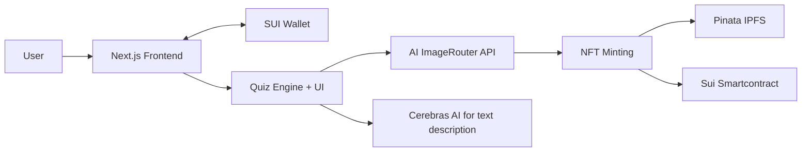

# 🎂 AI Cake NFT – Project Pitch Deck

## 🚀 Project Overview
AI Cake NFT is a fun and interactive DApp where users answer personality-based questions to generate a custom AI cake image and description. Users can mint their cake as an NFT on the SUI blockchain for 0.01 SUI.

## ❓ Problem
Most NFT projects lack personalization and emotional connection. We wanted to create something delightful, shareable, and truly unique for each user.

## 💡 Solution
We create a completely unique experience for each user through:

- A short personality quiz that uncovers user traits
- Real-time AI generation of a **one-of-a-kind cake image**
- A personalized description that reflects the user’s identity
- The ability to mint this unique creation as an NFT on the SUI blockchain

Unlike static NFT collections, **no two AI Cake NFTs are ever the same** — each one is dynamically generated at the moment of interaction.

## 🧠 How It Works
1. User answers a set of personality-driven questions.
2. Our AI system:
   - Creates a **custom cake image** based on the user's traits
   - Generates a descriptive summary of the user
3. The user views a unique preview generated **on the spot** — no pre-made content.
4. With a payment of 0.01 SUI, the user can mint the image as a personal NFT.
5. All minted cakes are viewable in a public gallery, showcasing the diversity of users.

> 🎨 Every cake is AI-generated at request time, making each one **truly unique and personal.**

## 💻 Tech Stack
* **Frontend**: [Next.js 15](https://nextjs.org/), based on [SUI DApp Starter](https://sui-dapp-starter.dev/)
* **Styling**: [Tailwind CSS](https://tailwindcss.com/)
* **Package Manager**: npm
* **Blockchain**: [SUI Network](https://sui.io/)
* **AI Integration**: [ImageRouter](https://ir.myqa.cc/) and [Cerebras AI](https://cloud.cerebras.ai/)
* **Storage**: [Pinata IPFS](https://pinata.cloud/)

## 🧱 Architecture

## 📈 Market Potential
- NFT market is shifting toward utility and personalization.
- AI + NFTs = trending intersection.
- Ideal for gamification, gifting, collectibles.

## 📅 Roadmap
- ✅ MVP with quiz, image gen, and minting
- ⏳ Mobile optimization
- ⏳ Add more quiz types / themes
- ⏳ Community features (sharing, badges, rankings)

## 👥 Team
Solo dev project, built for a hackathon.

## 🧾 Links
- **Live App**: https://your-ai-cake.vercel.app/
- **Repo**: https://github.com/kenkreck1004/your-ai-cake
